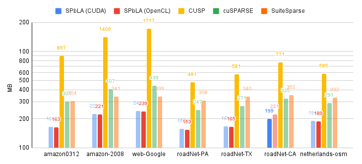

# Summary

`SPbLA` is a sparse Boolean linear algebra primitives and operations
for GPGPU computations. It comes as stand-alone self-sufficient 
library with C API for high-performance computing with multiple backends
for Nvidia Cuda, OpenCL and CPU-only platforms. The library has 
PyPI `pyspbla` package [@pyspbla] for work within Python runtime. 
The primary library primitive is a sparse matrix of Boolean values. The library 
provides the most popular operations for matrix manipulation, such as 
construction from values, transpose, sub-matrix extraction, matrix-to-vector 
reduce, matrix-matrix element-wise addition, multiplication and Kronecker product.  

# Statement of need

Answering research questions in data analysis often involves expressing the solution in terms of matrix/vector operations. 
This way it is possible to leverage a set of a powerful sparse linear algebra libraries.  
`GraphBLAS API` provides a set of unified linear algebra based building blocks for reducing analysis algorithms to 
sparse linear algebra operations. While GPGPU utilization for high-performance linear algebra is common, 
the high complexity of GPGPU programming makes the implementation of the complete set of sparse operations on GPGPU challenging. 
Thus, it is worth addressing this problem by focusing on a basic but still important case — sparse Boolean algebra.

The primary goal of the `SPbLA` is to provide a base for the implementation, 
testing and profiling high-performance algorithms for solving data analysis problems, 
such as RDF analysis [@article:cfpq_and_rdf_analysis], 
RNA secondary structure analysis [@article:rna_prediction], 
static code analysis (such as points-to or alias analysis) [@article:dyck_cfl_code_analysis] 
and evaluation of regular and CFL-reachability queries [@inproceedings:matrix_cfpq; @inbook:kronecker_cfpq_adbis]. 

Thus, we can offload different language-constrained path querying related problems, 
and other problems that can be reduced to manipulation of Boolean matrices, to GPGPU uniformly. 

Moreover, real data analysis leads to huge matrix processing that can not be efficiently 
handled on a single GPGPU. The creation of the library which supports multi-GPU and 
out-of-VRAM computations helps to create an efficient solution for a wide range of applied problems. 
The creation of such a solution is an open problem while ad-hoc solutions exist in specific areas. 
We propose an `SPbLA` as a base for such a solution.

Also, we hope, that the library is a small step to move the implementation of 
the fully-featured sparse linear algebra as specified in `GraphBLAS` forward multi-GPU computations.

# Related tools

`GraphBLAS API` [@paper:graphblas_foundations] is one of the first standards, that
formalize the mathematical building blocks in the form of the programming interface
for implementing algorithms in the language of the linear algebra. 
`SuiteSparse` [@article:suite_sparse_for_graph_problems] is a reference implementations
of the `GraphBLAS API` for CPU computation. It is mature and fully featured library
with number of bindings for other programming languages, such as `pygraphblas` [@pygraphblas] 
for Python programming.

GPGPU's utilization for data analysis and for linear algebra operations is a promising 
way to high-performance data analysis because GPGPU is much more powerful in parallel
data processing. However, GPGPU programming is still challenging.
Best to our knowledge, there is no complete `GraphBLAS API` implementation for GPGPU
computations, except `GraphBLAST` [@yang2019graphblast], which is currently in the
active development. Some work is also done to move `SuiteSparse` forward GPGPU computations.

However, the sparsity of data introduces issues with load balancing, irregular data access, 
thus sparsity complicates the implementation of high-performance algorithms for 
sparse linear algebra on GPGPU. There is number of open-source and proprietary libraries,
which implement independently different sparse formats and operations.
Thus, there is no single solid sparse linear algebra framework.
Libraries such as `cuSPARSE` [@net:cusparse_docs], `bhSPARSE` [@10.1016/j.jpdc.2015.06.010], 
`clSPARSE` [@10.1145/2909437.2909442] and `CUSP` [@net:cusplibrary] have limited type 
and operators customization features with major focus on numerical types only.

# Performance

We evaluate the utility of the proposed library for some real-world matrix data.
The experiment itself is designed as a computational tasks, 
which arises as stand-alone or intermediate step in the solving of practical problems.
Results of the evaluation compared to CPU `SuiteSparse` and existing GPU sparse linear algebra libraries. 
The comparison is not entirely fair, since there are still no Boolean linear algebra libraries for GPU computations.

Machine for performance evaluation has the following configuration:
PC with OS Ubuntu 20.04 installed, Intel Core i7-6700 3.4Hz CPU, 64Gb DDR4 RAM,
GeForce GTX 1070 GPU with 8Gb VRAM.

| Matrix name     | # Rows      | Nnz M       | Nnz/row   | Max Nnz/row | Nnz M^2     |
|---              |---:         |---:         |---:       |---:         |---:         |
| amazon0312      | 400,727     | 3,200,440   | 7.9       | 10          | 14,390,544  |
| amazon-2008     | 735,323     | 5,158,388   | 7.0       | 10          | 25,366,745  |
| web-Google      | 916,428     | 5,105,039   | 5.5       | 456         | 29,710,164  |
| roadNet-PA      | 1,090,920   | 3,083,796   | 2.8       | 9           | 7,238,920   |
| roadNet-TX	  | 1,393,383   | 3,843,320   | 2.7       | 12          | 8,903,897   |
| roadNet-CA	  | 1,971,281   | 5,533,214   | 2.8       | 12          | 12,908,450  |
| netherlands_osm | 2,216,688   | 4,882,476   | 2.2       | 7           | 8,755,758   |

For evaluation, we selected a number of square real-world matrices,
widely applicable for sparse matrices benchmarks, from the Sparse Matrix Collection 
at University of Florida [@data:suitesparse_matrix_collection]. Information about matrices summarized above. 
Table contains matrix name, number of rows in the matrix (the same as number of columns),
number of non-zero elements (Nnz) in the matrix, average and maximum nnz in row, nnz in the result matrix.

Experiment is intended to measure the performance of matrix-matrix multiplication as $M \times M$.
Results of the evaluation presented in \autoref{fig:perftime} and \autoref{fig:perfmem}. 
Results averaged among 10 runs. The deviation of results does not exceed 10%. Best and worst results highlighted.
Extra warm-up run, required for initialization and kernels compilation, is excluded from measurements.

`SPbLA` library shows the best performance among competitors for both OpenCL and Nvidia Cuda backends.
`CUSP` and `cuSPARSE` show good performance as well. However, they have significant
memory consumption in some cases, what can be a critical limitation in practical analysis tasks.
`SuiteSparse` library on CPU has acceptable performance characteristics, and it is still a 
good alternative for CPU-only computations.

# Future research

First direction of the future research is library extension to multi-GPU environment support.
This step introduces a number of issues, such as memory management among computational
units as well as proper workload dispatch and granularity of parallel tasks.
Potential solution is to use a hybrid sparse matrix format, such as quadtree or blocked storage,
and utilize virtual memory. It is necessary to expose more control over expressions evaluations to the 
user in order to support matrix and expression level granularity among computational units. 

Finally, we plan to generalize computational kernels and primitives in order to
support arbitrary types and operations, defined by user. This step will allow
defining custom elements and functions, which will be executed on
GPU similarly as it is done for predefined Boolean values. 

# Acknowledgements

Work on the `SPbLA` project was supported by a grant from JetBrains Research.

# References